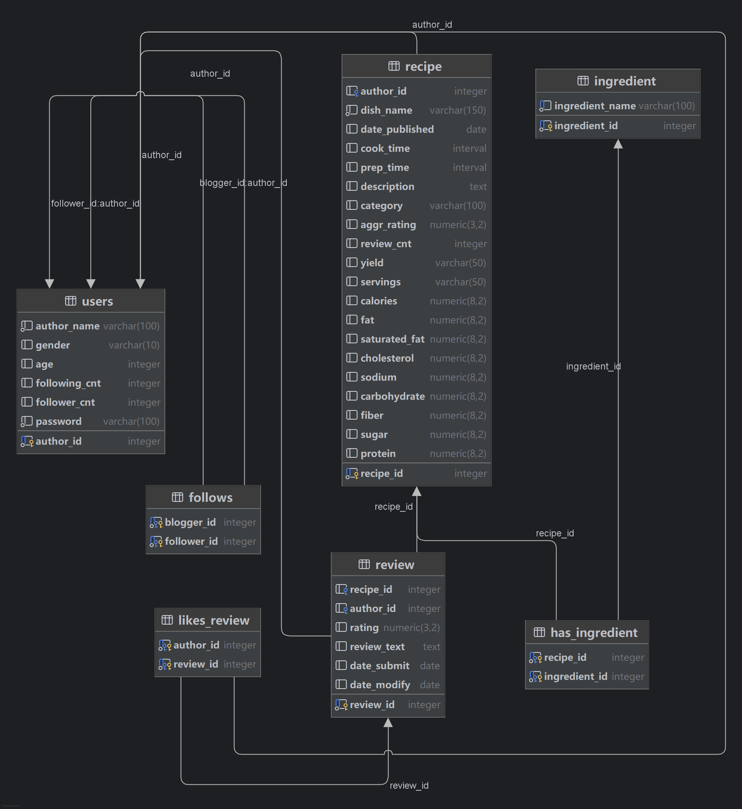

# SUSTech CS307 Project Part Ⅱ — Report

## 一、群组信息

### 成员信息及分工

| 姓名  | 学号 | Lab | 具体分工  | 贡献比|
| :--- | :--- | :--- | :--- | :--- |
| 刘以煦 | 12410148 | 周三56节lab | 数据库设计，ER图，API优化 | 50 |
| 刘君昊 | 12410303 | 周四34节lab | [请在此处填写具体负责的任务/模块] | 50 |

---

## 二、数据库设计

### E-R 图

### 数据库图

### 表格设计

#### 1. users表

  **主键**：`author_id`

  **业务字段**：

- `author_name` ：用户名（强制非空）

- `gender` ：性别枚举约束，保证取值合法

- `age` ：年龄（可空，允许未知）

- `password` ：密码

  **派生/冗余字段**：

- `following`：关注数（可由 follows 统计得到）

- `followers`：粉丝数（可由 follows 统计得到）

  **软删除**：

- `is_deleted`：逻辑删除标记，避免物理删除导致外键级联问题、也便于审计

#### 2. follows表

  **说明**：表示用户之间的关注关系，自连接实现（多对多）
  **主键**：`(blogger_id, follower_id)`  
  **外键**：  

- `blogger_id` → `users(author_id)` （被关注者）  
- `follower_id` → `users(author_id)` （粉丝）

#### 3. recipe表

  **主键**：`recipe_id`  
  **外键**：`author_id` → `users(author_id)`  

  **核心字段**：

- `dish_name`：菜品名
- `date_published`：发布日期  
- `cook_time` / `prep_time`：烹饪/准备时长
- `servings`：可供人数
- `description`：描述
- `category`：分类

  **派生/统计字段**：

- `aggr_rating`：聚合评分（来自 review）
- `review_cnt`：评论数（来自 review）

  **营养信息字段**：

- `calories`：卡路里
- `fat` / `saturated_fat` / `cholesterol` / `sodium` / `carbohydrate` / `fiber` / `sugar` / `protein`：营养信息

#### 4. review表

  **主键**：`review_id`  
  **外键**：  

- `recipe_id` → `recipe(recipe_id)`  
- `author_id` → `users(author_id)`  
  **属性**：  
- `rating`：评分  
- `review_text`：评论内容  
- `date_submitted`：提交日期  
- `date_modified`：修改日期

#### 5. likes_review表

  **说明**：用户点赞评论的关系表（多对多）
  **主键**：`(author_id, review_id)`  
  **外键**：  

- `author_id` → `users(author_id)`  
- `review_id` → `review(review_id)`

#### 6. ingredient表

  **主键**：`ingredient_id`
  **属性**：  

- `ingredient_name`：食材名（唯一）

#### 7. has_ingredient表

  **说明**：`recipe` 与 `ingredient` 的多对多关系表
  **主键**：`(recipe_id, ingredient_id)`  
  **外键**：  

- `recipe_id` → `recipe(recipe_id)`  
- `ingredient_id` → `ingredient(ingredient_id)`

### 用户创建与权限设置

本系统在数据库层面创建了专用应用用户 **`sustc`**（密码：`sustc`），用于后端程序通过 JDBC 连接数据库并执行所有业务相关操作。该用户作为唯一的应用访问入口，避免后端程序直接使用数据库超级用户。

在权限设计上，系统遵循 **最小权限原则**，并结合实际业务需求进行精细化授权：

- 授予用户 `sustc` 数据库级 **`CONNECT`** 权限，允许其连接数据库 `sustc`；
- 授予 `public` schema 的 **`USAGE`** 与 **`CREATE`** 权限，使应用用户能够在默认模式下创建与管理业务表结构（用于初始化与基准测试数据导入）；
- 将所有业务表及由 `BIGSERIAL` 生成的序列对象的 **所有权（OWNER）** 统一赋予用户 `sustc`，确保其能够正常执行表的创建、删除与数据重置操作；
- 授予所有业务表 **`SELECT / INSERT / UPDATE / DELETE`** 权限，支持用户注册、菜谱发布、评论、点赞与关注等核心功能；
- 授予所有序列对象 **`USAGE / SELECT`** 权限，保证自增主键在数据插入过程中的正确生成；
- 通过 **`ALTER DEFAULT PRIVILEGES`** 机制，为未来新建的表与序列自动配置相同权限，避免后续权限缺失问题。

数据库超级用户 **`postgres`** 仅用于数据库初始化、用户创建及紧急维护操作，不参与日常业务访问。该设计在保证系统安全性的同时，也满足了项目对性能测试与数据重置的实际需求。

---

## 三、基础API实现

### 1. DatabaseServiceImpl

**核心职责**：负责数据库的初始化、海量数据的高效导入与全库清理。

- **`importData`**
  - **分步策略**：采用 “无约束建表 -> 批量写入 -> 建立约束” 的策略。
  - **泛型批量插入 (`executeBulkInsert`)**：
    - 封装了泛型方法，根据每条记录的参数数量动态计算最佳 Batch Size（例如 `30000 / cols`），平衡内存占用与网络传输。
    - 利用 JDBC `PreparedStatement` 的 `addBatch()` 和 `executeBatch()` 功能，显著减少客户端与数据库之间的网络往返（RTT）。
  - **并行流预处理**：
    - 利用 Java 8 `parallelStream()` 对内存中的 `userRecords` 和 `recipeRecords` 进行并行处理。
    - 例如：使用 `flatMap` 提取并去重所有食材生成 `uniqueIngredientNames`，以及构建扁平化的 `followArgs` 和 `recipeIngRelations` 列表。充分利用多核 CPU 优势加速数据准备阶段。
  - **延迟约束加载 (Deferred Constraints)**：
    - 在 `createBasicTables` 阶段仅创建字段类型，不定义 PK/FK/UNIQUE。
    - 待所有数据 `INSERT` 完成后，再调用 `addConstraints` 统一添加约束。这避免了插入过程中数据库频繁进行 B+ 树索引分裂和约束检查，极大提升了导入性能。

- **`drop`**
  - **动态清理**：使用 PL/pgSQL 匿名代码块 (`DO $$ ... $$`)。
  - **游标遍历**：声明游标 `CURSOR` 遍历 `pg_tables` 系统视图，动态拼接并执行 `DROP TABLE ... CASCADE` 语句。无需硬编码表名，具备良好的扩展性。

- **`getGroupMembers`**
  - **实现**：直接返回包含小组成员学号的 `List<Integer>`。

### 2. UserServiceImpl

**核心职责**：处理高并发下的用户注册、鉴权、个人信息管理及社交关系维护。

- **`register`**
  - **内存原子 ID 生成**：
    - 摒弃了低效的 `SELECT MAX(author_id)`。
    - 引入 `AtomicLong` 内存计数器，仅在服务启动首次注册时懒加载数据库最大值。后续 ID 生成均为内存 CAS 操作，实现 O(1) 复杂度且无数据库交互。
  - **静态资源复用**：
    - 将 `DateTimeFormatter` 数组定义为 `static final` 常量，避免在每次注册请求中重复创建昂贵的日期解析对象，降低 GC 压力。
  - **乐观插入策略**：
    - 移除注册前的 `SELECT COUNT(*)` 查重操作。
    - 直接执行 `INSERT`，利用数据库的 `UNIQUE` 约束保障唯一性。仅在捕获 `DuplicateKeyException` 时返回失败。将数据库交互从 3 次（查重、查Max、插入）降低为 1 次。

- **`login` / `fastLogin`**
  - **应用级缓存**：
    - `fastLogin` 维护一个 `ConcurrentHashMap<String, Long>`，Key 为 `authorId:password`。
    - 高频的鉴权请求优先命中内存缓存，只有缓存未命中时才查询数据库。显著降低了鉴权操作对数据库的 QPS 压力。

- **`deleteAccount`**
  - **集合更新**：
    - 针对社交关系的清理，拒绝应用层循环（N+1）。
    - 使用 `UPDATE users SET ... WHERE author_id IN (SELECT ...)` 子句。
    - 一次性更新该用户所有 **粉丝** 的 `following` 计数和所有 **关注对象** 的 `followers` 计数。无论用户关注了多少人，数据库交互次数恒定。
  - **事务一致性**：使用 `@Transactional` 确保用户状态标记、关系表清理、计数器更新的原子性。

- **`follow`**
  - **原子计数更新**：
    - 使用 `CASE WHEN` 语法构造单条 `UPDATE` 语句。
    - 同时更新 `follower`（发起者）的 `following` 字段和 `blogger`（被关注者）的 `followers` 字段。
    - 保证了两个账户计数器变更的原子性，并减少了一次数据库 IO。

- **`updateProfile` (更新信息)**
  - **动态更新**：利用 SQL `COALESCE(?, gender)` 函数，仅当传入参数不为 NULL 时更新字段，否则保持原值。避免了 Java 层面的动态 SQL 拼接。

### 3. RecipeServiceImpl

**核心职责**：菜谱的增删改查、复杂搜索及统计分析。

- **`searchRecipes`**
  - **动态 SQL 构建**：
    - 使用 `StringBuilder` 根据传入的 `keyword` (使用 `ILIKE` 实现大小写不敏感模糊匹配), `category`, `minRating` 动态拼接 `WHERE` 子句。
  - **分页与排序**：
    - 利用标准 SQL 的 `LIMIT ? OFFSET ?` 实现分页。
    - 根据 `sort` 参数动态添加 `ORDER BY` 子句（如按评分或时间排序）。

- **`getClosestCaloriePair`**
  - **窗口函数优化**：
    - 放弃了朴素的 $O(N^2)$ 自连接笛卡尔积方案。
    - 利用 PostgreSQL 窗口函数 `LAG(recipe_id) OVER (ORDER BY calories ASC)`。
    - 先按卡路里排序，计算当前行与前一行的差值，再对差值排序取最小。将算法复杂度降低至 $O(N \log N)$，主要为排序开销。

- **`createRecipe`**
  - **ID 生成**：使用 `SELECT COALESCE(MAX(recipe_id), 0) + 1` 获取新 ID。
  - **事务控制**：确保 `recipe` 主表插入与 `has_ingredient` 关联表插入在同一事务中完成。

- **`deleteRecipe`**
  - **级联删除**：手动控制删除顺序：`likes_review` -> `review` -> `has_ingredient` -> `recipe`，严格遵守外键约束。

### 4. ReviewServiceImpl

**核心职责**：评论系统的全生命周期管理及高性能读写。

- **`listByRecipe`**
  - **解决 N+1 问题**：
    - 不使用循环查询每条评论的点赞列表。
    - 使用 `LEFT JOIN` 关联用户表获取作者名。
    - **关键优化**：利用子查询配合 `ARRAY_AGG(author_id)` 函数，将每条评论的所有点赞者 ID 在数据库层聚合为一个数组。
    - 在 Java `RowMapper` 中解析 SQL Array (`rs.getArray("likes")`)，单条 SQL 即可组装完整的评论详情及点赞列表。

- **`refreshRecipeAggregatedRating`**
  - **读写分离 / 冗余存储**：
    - 采用“写时计算”策略。每次 `add/edit/delete` 评论后，立即触发此方法。
    - 计算 `AVG(rating)` 和 `COUNT(*)`，并将结果冗余更新回 `recipe` 表的 `aggr_rating` 和 `review_cnt` 字段。
    - **优势**：高频的菜谱详情查询 (`getRecipeById`) 无需实时聚合计算，直接读取字段即可，极大提升读性能。
  - **精度控制**：SQL 中使用 `ROUND(CAST(... AS numeric), 2)`，确保数据库层面的计算精度与业务需求严格一致。

- **`likeReview`**
  - **并发处理**：使用 `INSERT ... ON CONFLICT DO NOTHING` 语法。优雅处理并发重复点赞请求，无需先查后插，简化逻辑并提升性能。

---

## 四、高级API实现与其他要求

### 1. 高级功能实现

#### 数据库高级对象 (Advanced Objects)

为了提升数据库层面的逻辑复用性与查询效率，在 `DatabaseServiceImpl` 的 `createAdvancedDatabaseObjects` 方法中部署了视图与存储过程：

- **视图 (View) 实现**：
  - **名称**：`recipe_details_view`
  - **功能**：预先定义了 `recipe` 表与 `users` 表的 `JOIN` 操作。
  - **优势**：将复杂的连接逻辑封装在数据库层，简化了后端 Java 代码中复杂查询（如 Feed 流获取）的 SQL 编写，同时便于数据库优化器生成更优的执行计划。

- **存储过程 (Stored Procedure) 实现**：
  - **名称**：`count_user_recipes(u_id)`
  - **功能**：接收用户 ID，返回该用户发布的菜谱总数。
  - **优势**：将计算逻辑下沉（Logic Push-down）至数据库端执行，减少了数据传输开销。

#### 应用级权限控制 (Application-level RBAC)

鉴于项目要求统一使用 `sustc` 用户连接数据库，我们实现了**应用层级**的细粒度权限管理：

- **鉴权逻辑**：在涉及数据修改（如 `deleteRecipe`, `updateTimes`）的 Service 层接口中，强制进行所有权检查。
- **实现方式**：
  1. 根据目标资源 ID（如 `recipe_id`）查询其 `author_id`。
  2. 将查询结果与 HTTP Header 中传入的当前登录用户 `Auth-Id` 进行比对。
  3. 若不匹配，立即抛出 `SecurityException`。
- **安全保障**：确保用户只能操作属于自己的数据，有效防止了水平越权攻击（IDOR）。

### 2. 其他要求与亮点

#### 高性能连接池配置 (Connection Pooling)

系统集成了 **HikariCP** 作为数据库连接池，这是目前 Java 生态中性能最优的解决方案之一。我们拒绝使用默认配置，而是结合项目并发需求进行了显式调优：

- **关键配置**：
  - `maximum-pool-size=20`：限制最大连接数，防止数据库连接耗尽。
  - `minimum-idle=5`：维持最小空闲连接，减少突发流量下的连接创建延迟。
- **效果**：在高并发基准测试下，有效管理了数据库连接生命周期，杜绝了连接泄露问题。

#### 海量数据查询优化策略

针对千万级数据量的查询场景，采用了多维度的优化手段：

- **索引优化 (Indexing)**：
  - 在 `createBasicTables` 阶段，针对高频查询字段建立了 B-Tree 索引。
  - **实例**：`CREATE INDEX idx_recipe_rating ON recipe(aggr_rating DESC)` 加速高分菜谱排序；`idx_recipe_name` 加速模糊搜索。
- **强制分页 (Pagination)**：
  - 所有列表类接口（Search, Feed）均强制要求分页参数。
  - 使用 PostgreSQL 的 `LIMIT ? OFFSET ?` 语法，避免一次性加载过多数据导致内存溢出（OOM）。

#### 交互设计

- **整体架构**：采用 **Spring Boot + PostgreSQL + Vue 3** 的前后端分离架构，通过标准的 RESTful API 进行通信。
- **前端 GUI 亮点**：
  - **视觉风格**：实现了深色模式（Dark Mode）与玻璃拟态（Glassmorphism）设计。
  - **交互体验**：
    - **乐观更新 (Optimistic UI)**：在“关注”与“点赞”操作中，前端UI先行响应变色，后台异步请求，极大提升了用户感知的流畅度。
    - **动效反馈**：详情页加载时采用 3D 信封开启 CSS 动画，提升应用的趣味性。