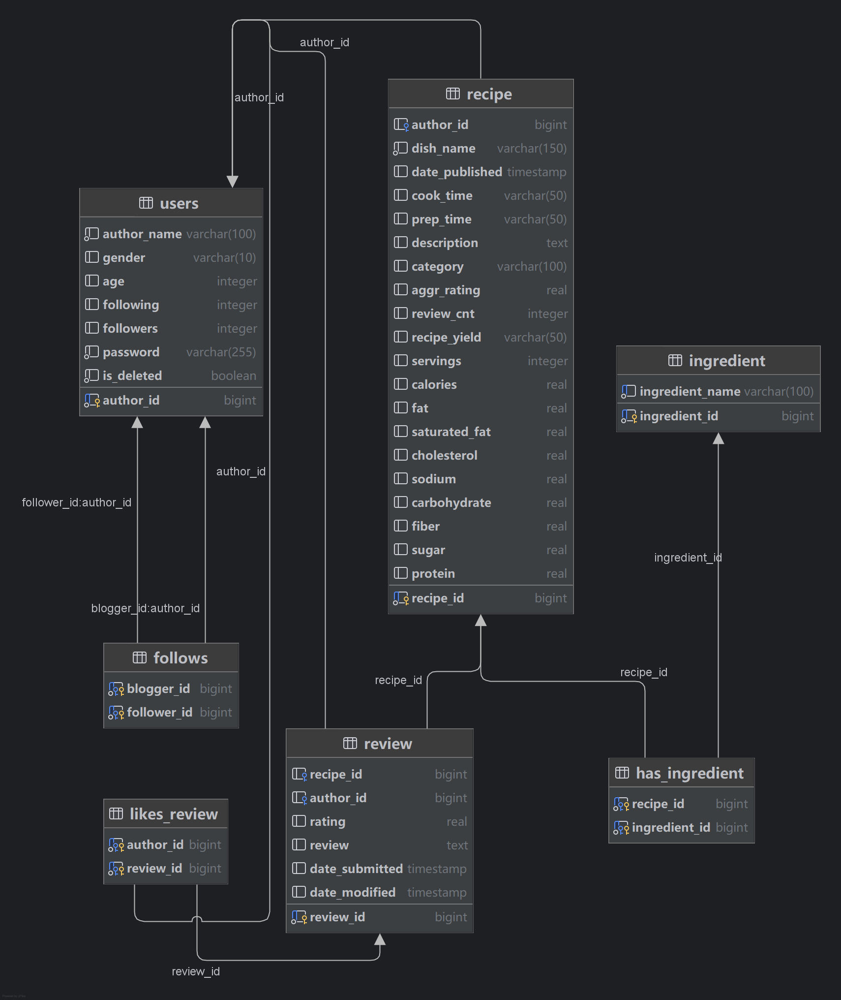

# SUSTech CS307 Project Part Ⅱ — Report

## 一、群组信息

### 成员信息

- **成员1**: 刘以煦 12410148 周三56节lab
- **成员2**: 刘君昊 12410303 周四34节lab

### 分工

---

## 二、数据库设计

### E-R 图

### 数据库图

### 表格设计

#### 1. users表

  **主键**：`author_id`

  **业务字段**：

- `author_name` ：用户名（强制非空）

- `gender` ：性别枚举约束，保证取值合法

- `age` ：年龄（可空，允许未知）

- `password` ：密码

  **派生/冗余字段**：

- `following`：关注数（可由 follows 统计得到）

- `followers`：粉丝数（可由 follows 统计得到）

  **软删除**：

- `is_deleted`：逻辑删除标记，避免物理删除导致外键级联问题、也便于审计

#### 2. follows表

  **说明**：表示用户之间的关注关系，自连接实现（多对多）
  **主键**：`(blogger_id, follower_id)`  
  **外键**：  

- `blogger_id` → `users(author_id)` （被关注者）  
- `follower_id` → `users(author_id)` （粉丝）

#### 3. recipe表

  **主键**：`recipe_id`  
  **外键**：`author_id` → `users(author_id)`  

  **核心字段**：

- `dish_name`：菜品名
- `date_published`：发布日期  
- `cook_time` / `prep_time`：烹饪/准备时长
- `servings`：可供人数
- `description`：描述
- `category`：分类

  **派生/统计字段**：

- `aggr_rating`：聚合评分（来自 review）
- `review_cnt`：评论数（来自 review）

  **营养信息字段**：

- `calories`：卡路里
- `fat` / `saturated_fat` / `cholesterol` / `sodium` / `carbohydrate` / `fiber` / `sugar` / `protein`：营养信息

#### 4. review表

  **主键**：`review_id`  
  **外键**：  

- `recipe_id` → `recipe(recipe_id)`  
- `author_id` → `users(author_id)`  
  **属性**：  
- `rating`：评分  
- `review_text`：评论内容  
- `date_submitted`：提交日期  
- `date_modified`：修改日期

#### 5. likes_review表

  **说明**：用户点赞评论的关系表（多对多）
  **主键**：`(author_id, review_id)`  
  **外键**：  

- `author_id` → `users(author_id)`  
- `review_id` → `review(review_id)`

#### 6. ingredient表

  **主键**：`ingredient_id`
  **属性**：  

- `ingredient_name`：食材名（唯一）

#### 7. has_ingredient表

  **说明**：`recipe` 与 `ingredient` 的多对多关系表
  **主键**：`(recipe_id, ingredient_id)`  
  **外键**：  

- `recipe_id` → `recipe(recipe_id)`  
- `ingredient_id` → `ingredient(ingredient_id)`

### 用户创建与权限设置

本系统在数据库层面创建了专用应用用户 **sustc**（密码：`sustec`），用于后端程序连接数据库并执行所有业务操作。

在权限设计上，遵循**最小权限原则**：

- 授予 `sustc` 数据库级 `CONNECT` 权限，允许其连接数据库 `sustc`；
- 授予 `public` schema 的 `USAGE` 权限，使其可访问默认模式；
- 授予所有业务表的 `SELECT / INSERT / UPDATE / DELETE` 权限，支持用户注册、发布菜谱、评论、点赞与关注等核心功能；
- 授予所有由 `BIGSERIAL` 生成的序列 `USAGE / SELECT` 权限，确保自增主键插入正常执行。

所有表结构创建与模式修改等 DDL 操作仅由管理员用户 `postgres`完成，应用用户不具备建表或删表权限，从而保证系统安全性与可维护性。

---

## 三、基础API实现

